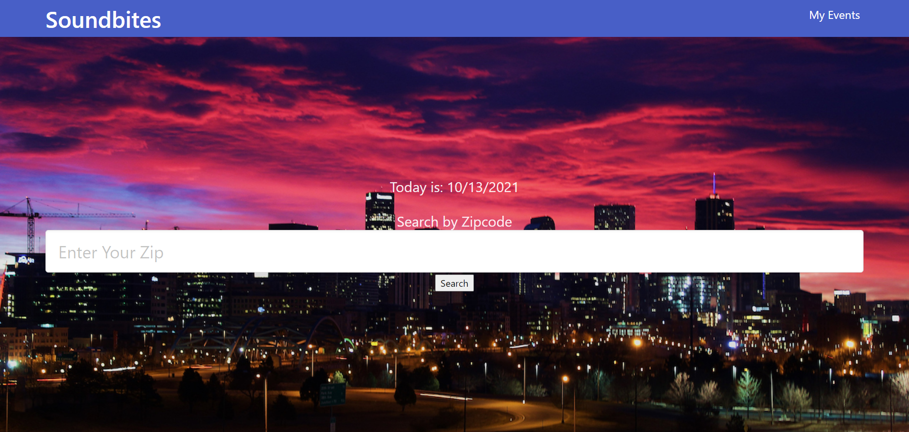

# Project1

## AC
As a user I want to plan my evening(s) of entertainment from available events.

Given I need to find an event near me
Then I can search by my location
Given I choose an event
Then I am Given a list of places to dine out

## Project Requirements

You and your group will use everything you’ve learned over the past six units to create a real-world front-end application that you’ll be able to showcase to potential employers. The user story and acceptance criteria will depend on the project that you create, but your project must fulfil the following requirements:

* Use a CSS framework other than Bootstrap.

* Be deployed to GitHub Pages.

* Be interactive (i.e., accept and respond to user input).

* Use at least two [server-side APIs](https://coding-boot-camp.github.io/full-stack/apis/api-resources).

* Does not use alerts, confirms, or prompts (use modals).

* Use client-side storage to store persistent data.

* Be responsive.

* Have a polished UI.

* Have a clean repository that meets quality coding standards (file structure, naming conventions, follows best practices for class/id naming conventions, indentation, quality comments, etc.).

* Have a quality README (with unique name, description, technologies used, screenshot, and link to deployed application).

We worked together as team to build our page. The first ever roadblock we faced was having a concrete idea.
With Jose as the team leader and everyone working with each other in areas we weren't too familiar with, we 
had a deployable page. Ryan really helped with the API's. The very first one he provided us with was "SeetGeek",
and the second being "FourSquare". Jose basically managed most of the jQuery section while walking us through what 
he was doing. Ryan and Zaymon helped each other with how they wanted the page to look, as well as giving classes
and ID's to the elements. Jess helped us with brainstorming and provinding us with helpfull links to certain
issues at hand. We utilized local storage, two API's, and our page was mobile friendly thanks to Bulma.
